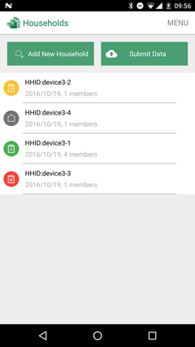
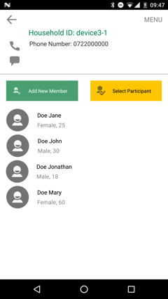
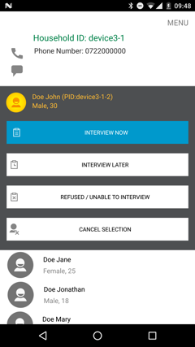

# WHO STEPS App 

STEPS is an Android application developed for the World Health Organization's STEPwise approach to noncommunicable disease risk factor surveillance. The app is used to register households and household members during survey rounds and then randomly select a household member to interview. The randomization uses the [KISH method](https://en.wikipedia.org/wiki/Kish_grid). Once a household member is selected for interview, the survey is launched in the [ODK Collect](https://opendatakit.org/use/collect/) application. Supported languages are English, French, Spanish, Russian, and Arabic.

Here are some screenshots of the Android app:

  

For more information, see http://www.who.int/chp/steps/en/.
